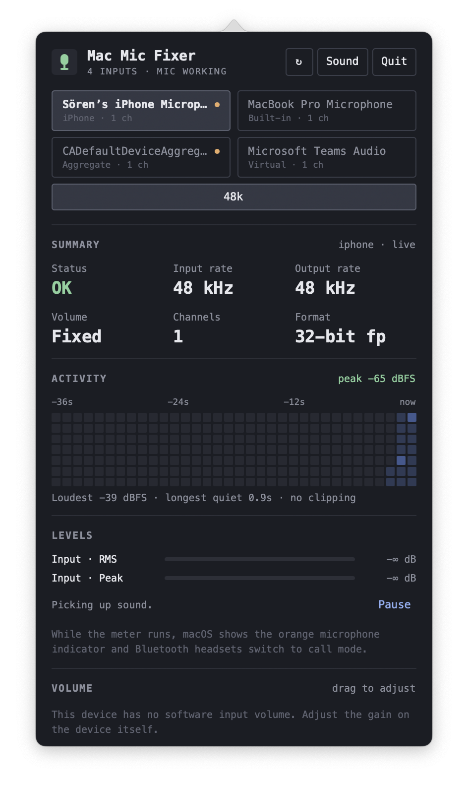
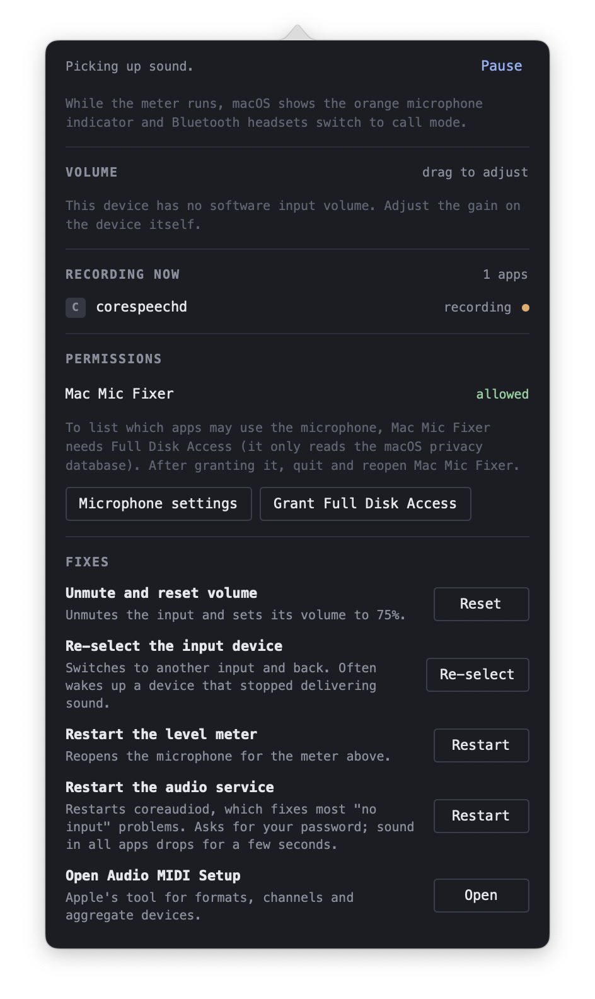

# Mac Mic Fixer

A menu bar app that tells you why your Mac's microphone isn't working, and fixes it in one click.

It lives in the menu bar, and the icon turns into a crossed-out microphone when the input is muted or broken. Click it to see which device macOS records from, whether that device actually delivers sound, and which apps are using the microphone right now.

<p>
  
  
</p>

## Install

Download `MacMicFixer-<version>.dmg` from the [latest release](https://github.com/ssteiger/mac-mic-fixer/releases/latest), open it and drag MacMicFixer to Applications. It runs on macOS 14 or later, on Apple Silicon and Intel.

The app is not notarized by Apple, so macOS blocks the first launch. Open System Settings > Privacy & Security, scroll down and click "Open Anyway" next to the message about MacMicFixer. Alternatively, run:

```sh
xattr -dr com.apple.quarantine /Applications/MacMicFixer.app
```

Because each release has a new ad-hoc signature, macOS asks for microphone access (and forgets Full Disk Access) again after every update.

## Features

- **Fix my mic:** one button at the top that resets the input after a call app (Slack, Zoom, Teams, ...) left it crackling or silent. It disables the Background Music driver if it is installed, restarts `coreaudiod`, selects the built-in mic at 48 kHz and unmutes it.
- **Device and sample rate switching:** pick the default input and its sample rate from a chip grid.
- **Summary:** status, input and output sample rate, volume, channel count and sample format at a glance.
- **Activity and levels:** a live RMS and peak meter plus a heatmap of the last ~36 seconds, so you can tell "silent" from "quiet" from "clipping".
- **Volume and mute:** drag the input volume or toggle mute, for devices that support it.
- **Recording now:** which apps currently hold the microphone open.
- **Permissions:** whether Mac Mic Fixer has microphone access and, with Full Disk Access, which other apps are allowed to use the microphone (read from the macOS privacy database).
- **Fixes:** unmute and reset volume, re-select the input device, restart the level meter, restart `coreaudiod`, or open Audio MIDI Setup.

### Detected problems

When something looks wrong, a card with a matching one-click fix appears at the top:

| Problem | Fix |
| --- | --- |
| No input device, or the device stopped responding | Re-select the device or restart the audio service |
| Input is muted or its volume is near zero | Unmute and reset volume |
| The mic delivers pure digital silence | Restart the audio service |
| No sound detected for a few seconds | Re-select the device |
| Mac Mic Fixer has no microphone permission | Open Privacy & Security |
| Bluetooth headset dropped to call quality | Switch to the built-in mic |
| Input and output sample rates differ | Match the sample rates |
| Default input is a virtual or aggregate device | Switch to the built-in mic |

### Touch ID for audio restarts

Restarting `coreaudiod` needs root. The first restart asks for your admin password and installs a small helper, `/Library/PrivilegedHelperTools/com.macmicfixer.reset-audio`, plus a sudoers rule, `/etc/sudoers.d/mac-mic-fixer`, that lets your user run it without a password. After that, Mac Mic Fixer asks for Touch ID (or your Apple Watch) before each restart. The helper can only quit `coreaudiod` and move the Background Music driver to `/Library/Audio/Plug-Ins/Disabled by Mac Mic Fixer`. The Touch ID check happens in the app, so any program running as your user could restart the audio service without asking.

To remove the helper:

```sh
sudo rm /etc/sudoers.d/mac-mic-fixer /Library/PrivilegedHelperTools/com.macmicfixer.reset-audio
```

While the level meter runs, macOS shows the orange microphone indicator, and Bluetooth headsets switch to call mode. Pause the meter to avoid both.

## Development

Mac Mic Fixer is a [React Native for macOS](https://microsoft.github.io/react-native-windows/docs/rnm-getting-started) app. The UI is in TypeScript (`App.tsx`, `src/`), and the CoreAudio, TCC and status item code is in Objective-C++ (`macos/MacMicFixer-macOS/`). It uses [Bun](https://bun.sh) as package manager, [Biome](https://biomejs.dev) for linting and formatting, and Jest for tests.

Make sure you have completed the React Native [environment setup](https://reactnative.dev/docs/set-up-your-environment) for macOS (Xcode and CocoaPods), then:

```sh
bun install
bundle install                         # first time only, installs CocoaPods
cd macos && bundle exec pod install    # after cloning or changing native deps
```

Start Metro, then build and launch the app in a second terminal:

```sh
bun start
bun run macos
```

You can also build from Xcode via `macos/MacMicFixer.xcworkspace`. The app has no Dock icon; look for the microphone in the menu bar.

### Checks

```sh
bun run lint       # Biome lint + format check
bun run format     # apply Biome fixes and formatting
bun run typecheck  # TypeScript
bun run test       # Jest
```

### Releasing

Push a version tag and GitHub Actions (`.github/workflows/release.yml`) runs the checks, builds a universal DMG and publishes it as a GitHub release:

```sh
git tag v0.1.0
git push origin v0.1.0
```

To build the same DMG locally, run `scripts/build-release.sh 0.1.0`. It writes `build/release/MacMicFixer-0.1.0.dmg`.

### Patched dependencies

`patches/react-native-macos@0.79.4.patch` (applied automatically by `bun install`) fixes a bug in `RCTDataRequestHandler` and `RCTFileRequestHandler` where a request token was never assigned. Without it, loading `data:` or `file:` URLs logs "Unrecognized request token" errors that open a RedBox over the popover.
